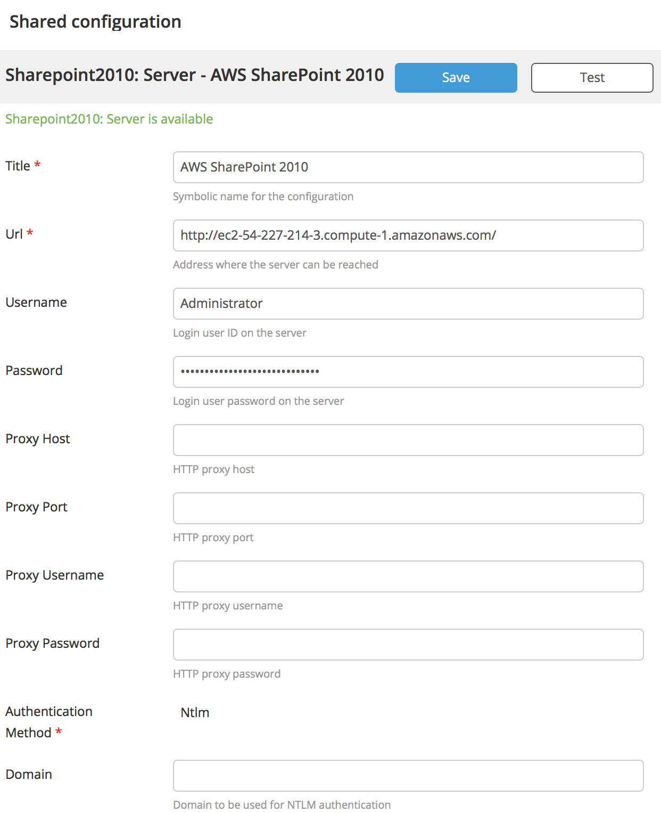

# xlr-sharepoint-plugin

Alpha workspace

# Testing
This readme assumes familiarity with Amazon EC2. Now, it's possibly that you haven't spun up Amazon EC2 instance before. Go educate yourself and spin up a random Windows box and connect to it so you know how to work Amazon. There's beautiful guide on the interwebz, just Google It (c).

Spin up this AMI in Amazon EC2: [SharePoint Foundation 2013-8758580e-2263-4dae-9456-6cb2baf2b041-ami-eedc7094.4 (ami-dd55dda7)](https://aws.amazon.com/marketplace/pp/B078G4SNP3?qid=1516836228849&sr=0-2&ref_=srh_res_product_title). Note that the exact AMI ID and description can change, but the important part is that it's SharePoint 2013 (which is the target SharePoint version of this plugin rn). Follow the instructions on how to initialize the sharepoint copy.

Add a inbound rule allowing your IP to connect to port 80 (http). Since the SharePoint version might have vulnerablities, I recommend against exposing this image to the whole big bad internet.

*WEIRD BUG/THING*: always start connecting by browser to http://internal_hostname/_api/contextInfo on the AWS instance itself. I don't understand why, but unless you've done that first Sharepoint serves you 500's trying to connect from outside. Maybe related to 'DisableStrictNameChecking' (google for it).

Log in using basic authentication using the Administrator account. Voila, Bob's your uncle.